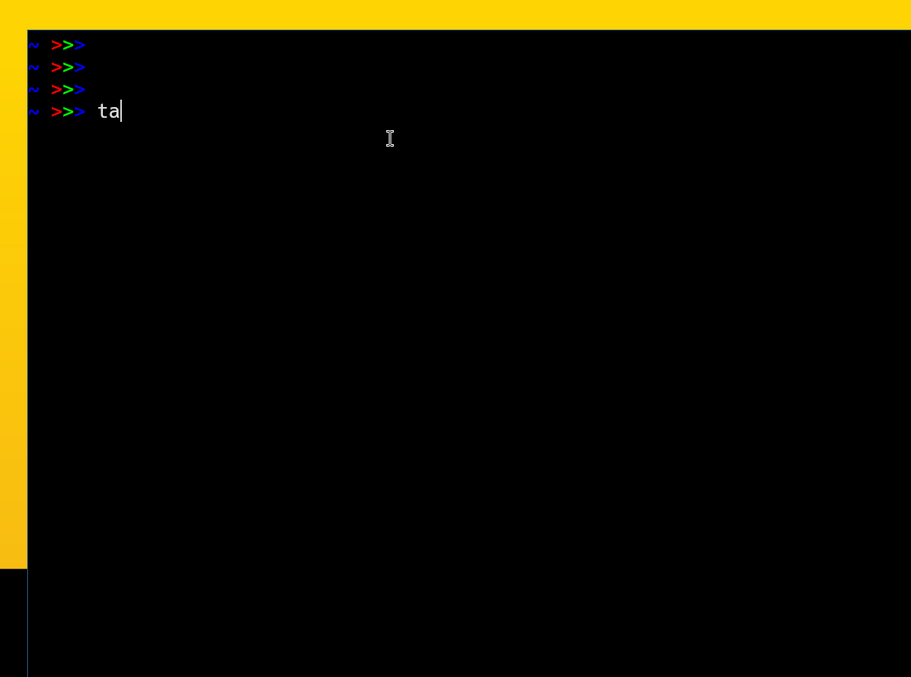

# Tasky - task tracker №1

Task tracker with user-friendly and easy-to-understand controls. The program structure allows you to manipulate your tasks with ease.\
All tasks in one place !) 

- [Tasky - task tracker №1](#tasky---task-tracker-1)
  - [About](#about)
  - [How to use](#how-to-use)
  - [Build](#build)
      - [Directly by the compiler](#directly-by-the-compiler)
      - [Make](#make)
      - [CMake](#cmake)
  - [Support](#support)
  - [Contact](#contact)
  - [License](#license)

## About

Tasky was originally conceived as a small pet project. But as it was developed and designed, it became a full-fledged minimal task tracking system. On the way of development there were often various bugs and difficulties. Sometimes we had to rewrite a whole piece of code because it was unusable and inefficient. This is one of the reasons to consider Tasky a reliable tracker as it is being perfected\*.

The principle of operation is based on specifying a **command**  to the program and passing the corresponding **ID** to the program \
Each task receives a *unique* ID when it is created 

---
The structure of tasky is simple - one executable file and two configuration files:
- *data.json* - contains all available tasks
- *issued_ID.txt* - contains all issued IDs

The configuration files are either in the path `$XDG_CONFIG_DIR/tasky/` , or in the path `$HOME/.config/tasky/`

Depending on the build method, the configuration directory is created automatically or manually by the user. More information in [Build](#build)


## How to use

For a little background on the team's capabilities
```shell
tasky help
```

To create a task, use the `add` command and the name or description of the task
```shell
tasky add <SOME_DESCRIPTION>
```

To delete a task, `delete` is used to delete the task. It is also possible to delete **ALL** tasks with the argument all
```shell
tasky delete <TASK_ID>
tasky delete all
```

To `edit` an existing task
```shell
tasky edit <TASK_ID> <NEW_DESCRIPTION>
```

The `mark-done` and `mark-in-progress` commands are used to mark a task as completed or a task in progress, respectively
```shell
tasky mark-done <TASK_ID>
tasky mark-in-progress <TASK_ID>
```

A `list` is used to show all existing tasks. You can also display tasks that have been completed and tasks that are still in progress 
```shell
tasky list
tasky list done
tasky list in-progress
```

## Build

Tasky supports three build options: compiler, make utility, and CMake build system

> The make and CMake options automatically create configuration directories and add Tasky to $PATH
Compiler builds do not do this. How to do this will be described below

**We strongly recommend that you use *make* or *CMake* to build the Tasky**

#### Directly by the compiler

Build can be done with g++ or clang++ compilers

For g++
```shell
git clone https://github.com/termbit/tasky
cd tasky
g++ -o tasky main.cpp
```

For clang++
```shell
git clone https://github.com/termbit/tasky
cd tasky
clang++ main.cpp
```

#### Make

Use *Makefile-default* to build
```shell
git clone https://github.com/termbit/tasky
cd tasky
make -f Makefile-default
```

#### CMake

The minimum required CMake version for a build is 3.10

Create a build directory and start the build itself
```shell
git clone https://github.com/termbit/tasky
cd tasky
mkdir build
cd build
cmake ..
cmake --build .
```

## Support

> *The developers will be very grateful and thankful for > all bugs and inaccuracies found in Tasky* \
Sincerely, termbit\) \
\
>Contact mail - fre33-man@proton.me

## Contact 

You can use all available github functions (like *issues*, etc.)

e-mail - fre33-man@proton.me

## License

Tasky is licensed under the [GNU Affero General Public License](https://www.gnu.org/licenses/agpl-3.0.txt)

---

This file is part of Tasky.

Tasky is free software: you can redistribute it and/or modify it under the terms of the GNU Affero General Public License as published by the Free Software Foundation, either version 3 of the License, or (at your option) any later version.

Tasky is distributed in the hope that it will be useful, but WITHOUT ANY WARRANTY; without even the implied warranty of MERCHANTABILITY or FITNESS FOR A PARTICULAR PURPOSE. See the GNU Affero General Public License for more details.

You should have received a copy of the GNU Affero General Public License along with Tasky. If not, see <https://www.gnu.org/licenses/>. 

© Copyright 2024 termbit

---

Tasky uses in its code base the JSON for Modern C++ library by [Niels Lohmann](https://nlohmann.me/), licensed under the [MIT license](https://opensource.org/license/MIT). Copyright © 2013-2022 [Niels Lohmann](https://nlohmann.me/)


---
*\*The developers are not responsible for moral, material and other types of damage. No guarantees are provided. Use at your own risk.*